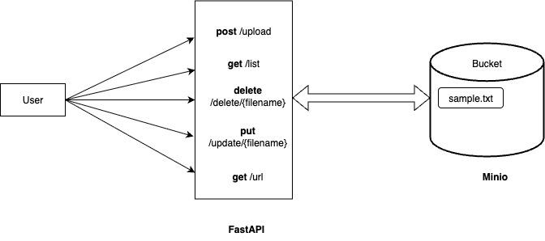

**ARCHITECTURE DIAGRAM**

**MINIO SETUP IN LOCAL:**  
curl -O https://dl.min.io/server/minio/release/darwin-arm64/minio  
chmod +x ./minio  
sudo mv ./minio /usr/local/bin/   

mkdir -p ~/minio-data  

MINIO_ROOT_USER=minioadmin \   
MINIO_ROOT_PASSWORD=minioadmin \
minio server ~/minio-data --console-address ":9001"

This will help to run the minio server. 
minio provides two kind of access which are GUI and API.  
For GUI purpose use localhost:9001 which will be useful in seeing the changes which are done in the bucket. Even we can create our own bucket using the GUI.

For API’s we can use the localhost:9000 to use in our python code part. 
To use the api in python we have to establish the connection using,
Client = Minio(‘localhost:9000’,access_key=’minioadmin’,secret_key=’minioadmin’,secure=False)
Note: secure= False -> setting up to http instead of https 

Note: make sure to keep the server on. Whenever doing operations.

**ENVIRONMENT CONFIGURATIONS:**  
MINIO_DOMAIN="localhost"  
MINIO_PORT=9000  
MINIO_PASSWORD="minioadmin"  
MINIO_USER_NAME="minioadmin"  
MINIO_BUCKET="testbucket"  

**INSTALLATION SETUP:**  
1.	Python version (3.11) 

2.	Conda virtual environment  
create conda -n minio-env python=3.11  
conda activate minio-env 

3.	Install dependencies  
pip install -r requirements.txt

4.	Make sure minio server is running in the background (refer minio setup in local)

5.	Frontend Setup (React)
Create app
cd minio
npx create-react-app frontend
cd frontend
npm install axios

6.	Start FastAPI:

python -m uvicorn app.main:app --reload

7.	Run frontend: 

cd minio/frontend  
npm start

**API ENDPOINTS:**

http -> method	Endpoint ->	Description  
POST	-> /upload ->	Upload file to minio bucket.  
GET ->	/list ->	List all the files available in the bucket.  
GET ->	/get-url?filename=sample.txt -> Get the url for the file to access it in the web.  
PUT -> /update/{file_name} -> Update the already existing file.  
DELETE	-> /delete/{filename}	-> Delete a specific file  

**FILE STORAGE DESIGN:** 
i.Objects are stored in the minio by their filename as a key. 
ii.Stored in the defined bucket. 

**TESTING:**  
i.Use swagger-UI localhost:8000/docs  
ii.POSTMAN for uploading the file and test the working.  
Note: Use the minio GUI (localhost:9001) for further checking the file is uploaded properly. 

**Manual CLI for docker minIO**
Manual CLI for docker minIO :  
docker run -d \  
  --name minio-server \  
  -p 9000:9000 \  
  -p 9001:9001 \  
  -e "MINIO_ROOT_USER=minioadmin" \  
  -e "MINIO_ROOT_PASSWORD=minioadmin123" \  
  quay.io/minio/minio:RELEASE.2023-12-02T10-29-32Z \  
  server /data --console-address ":9001"  
Note: this will create and run the minio-server in the docker and exposing it to our local via port localhost:9001 for the GUI and localhost:9000 for the api instances. This will create a storage volume inside the docker for storing the files which we are intended to upload.  

We can use the docker-compose.yml which is efficient instead of manually creating the docker container using the CLI.  
inorder to create a container:  
docker compose up -d  
Note: this will create a docker compose and start to run the server. You verify using the localhost:9001 with the username and password.  
docker ps : will list the containers in run.  

Whenever you finished your operation. You can either down(removing the container) or stop the container.  
docker compose stop – will stop the containers from working but still resist the information and all the containers details within. So you can start it again whenever needed it out.  
In order to start the container again use, docker compose start  

docker compose down – will entirely remove the containers.  
Note: still the data will be persist on the local which will not be deleted in this scenario.  

